# Q-Vote — Quantum-Secured Web3 Voting System

Condensed, polished README for the Qiskit Fall Fest submission. Paste your repo link and add the screenshot PNG files (screenshot1.png … screenshot7.png) to this folder to enable the demo images.

# Q-Vote — Quantum-Secured Web3 Voting System

Condensed, polished README for the Qiskit Fall Fest submission. Paste your repo link and add the screenshot PNG files (screenshot1.png … screenshot7.png) to this folder to enable the demo images.

## Team Members
- Arnold Achiki
# Q-Vote — Quantum-Secured Web3 Voting System

Condensed, polished README for the Qiskit Fall Fest submission. Paste your repo link and add the screenshot PNG files (screenshot1.png … screenshot7.png) to this folder to enable the demo images.

## Team Members
- Arnold Achiki
- LEAH MATHENGE
- OLIVE CAROLINE

## Team Members
 - Arnold Achiki
 - LEAH MATHENGE
 - OLIVE CAROLINE

## Short Description

Q-Vote is a next-generation voting platform that combines quantum-resistant cryptography, blockchain immutability, and biometric verification to deliver a secure, transparent, and accessible election system — especially tailored for Kenya's electoral context.

## Quick Links
 - Demo screenshots: `screenshot1.png` … `screenshot7.png`
 - Repository: https://github.com/ARNOLDACHIKI/q-vote.git

## Why this matters (Kenya, 2027)

 - Restores trust after disputed elections by providing cryptographic proof of integrity
 - Eliminates manual result transmission (no more Forms 34A/34B manipulation)
 - Enables diaspora voting for 3M+ Kenyans abroad
 - Reduces election costs and dependence on KIEMS hardware

## How it works — at a glance

1. Voter registration with biometric verification and national ID linking
2. Authentication using quantum-secured keys + biometrics + OTP
3. Vote encryption using QKD-generated session keys
4. Encrypted vote submission to smart contract (Ethereum/Polygon testnet)
5. Voter receives a unique verification code (SMS + in-app) to confirm recording
6. Smart contracts handle tallying and publish live, auditable results

## Architecture (layers)

 - Quantum Security Layer: QKD (BB84) + post-quantum cryptography (Qiskit Terra/Aer)
 - Blockchain Layer: Smart contracts for eligibility, casting, anti-duplication, tallying
 - Identity & Registration: Biometric capture, document verification, IPRS integration
 - Voter Interface: React PWA + React Native, low-bandwidth & USSD fallback

## Technical stack

 - Frontend: React.js (PWA)
 - Backend: Node.js / Flask APIs
 - Quantum: Qiskit (Terra, Aer)
 - Blockchain: Solidity smart contracts (Ethereum/Polygon testnet)
 - Storage: IPFS for encrypted biometric artefacts
 - Messaging: Africa's Talking / SMS gateways
 - Mobile: React Native (iOS/Android)

## Key Features

 - Quantum-resistant encryption (QKD + PQC)
 - Immutable on-chain vote records
 - Biometric multi-factor authentication
 - Remote and diaspora voting support
 - Voter verification codes and public audit trail
 - Low-bandwidth & USSD support for feature phones

## Demo / Screenshots

Place the screenshot files in this folder and they'll render below.

1. Voter Dashboard
   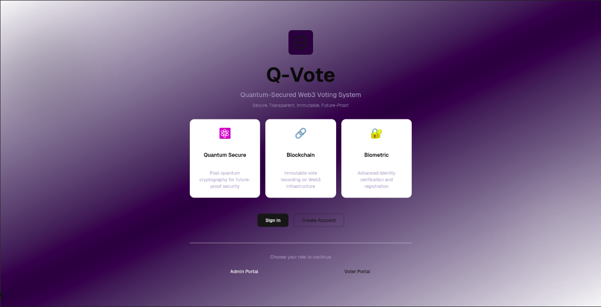

2. Election Results
   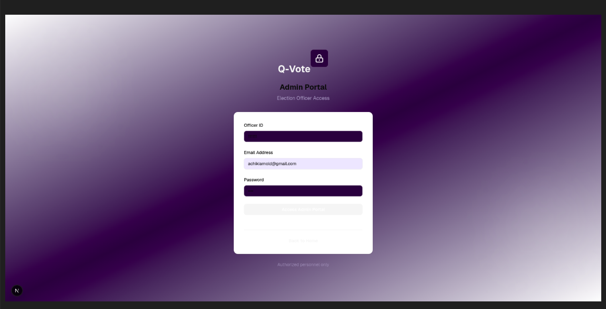

3. Voting Portal
   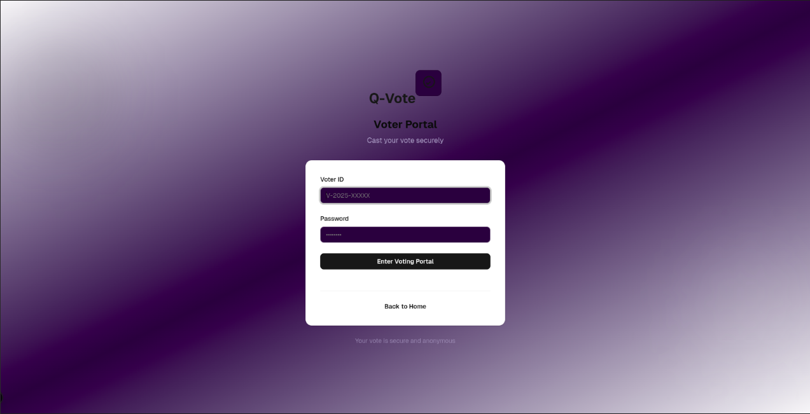

4. Vote Verification
   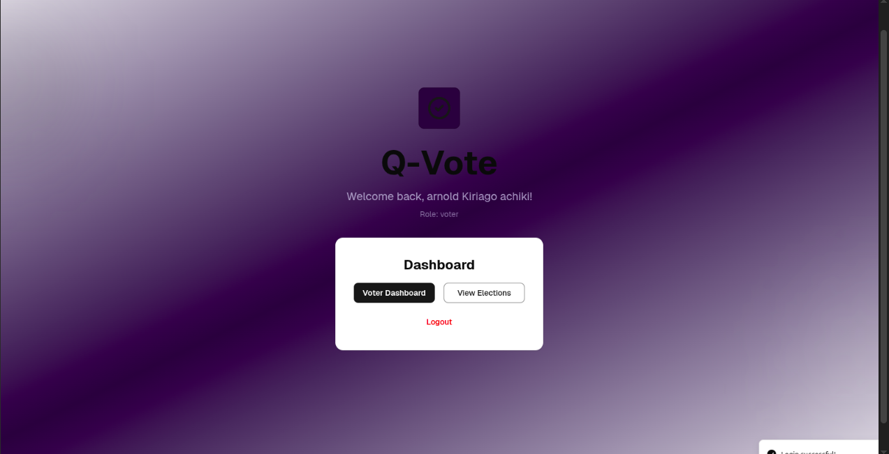

5. Transparency / Audit Info
   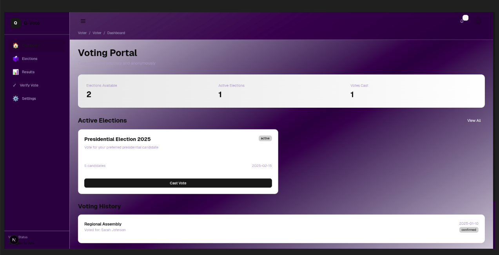

6. Security Features
   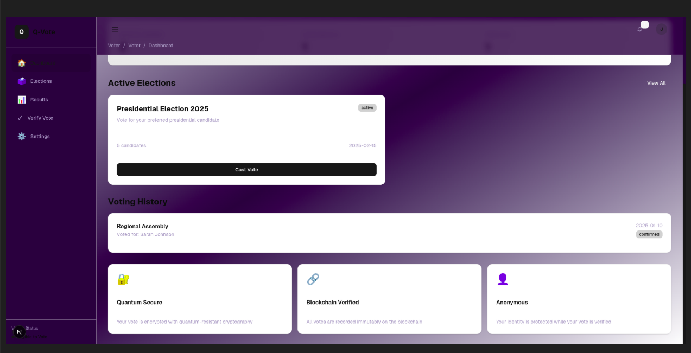

7. Notifications System
   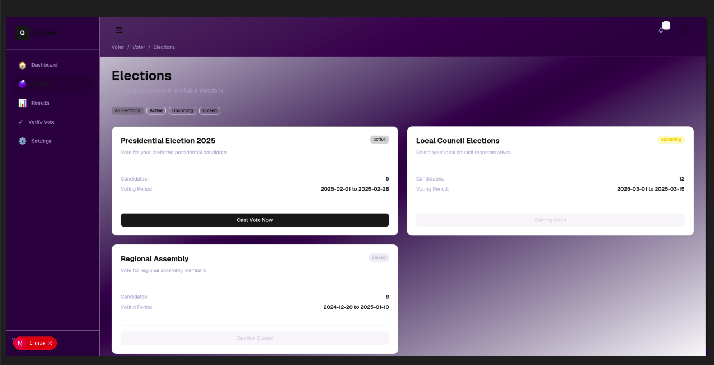

If you prefer different filenames, update the markdown image paths accordingly.

## How to run (developer notes)

These are example steps — adapt to your implementation.

1. Clone the repo

   

2. Frontend
   
   cd frontend
   npm install
   

3. Backend
   
   cd backend
   pip install -r requirements.txt    # or npm install if Node
   

4. Smart contracts
   
   cd contracts
   npm install
   

8. Admin Portal Login
   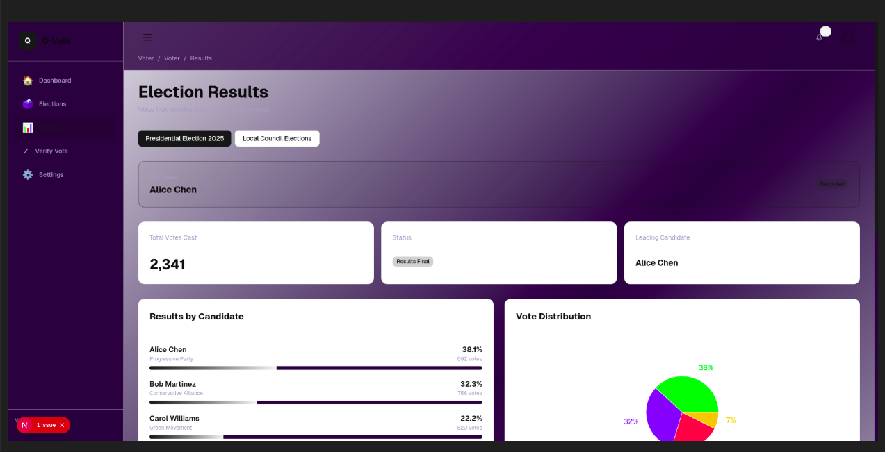

9. Voter Login
   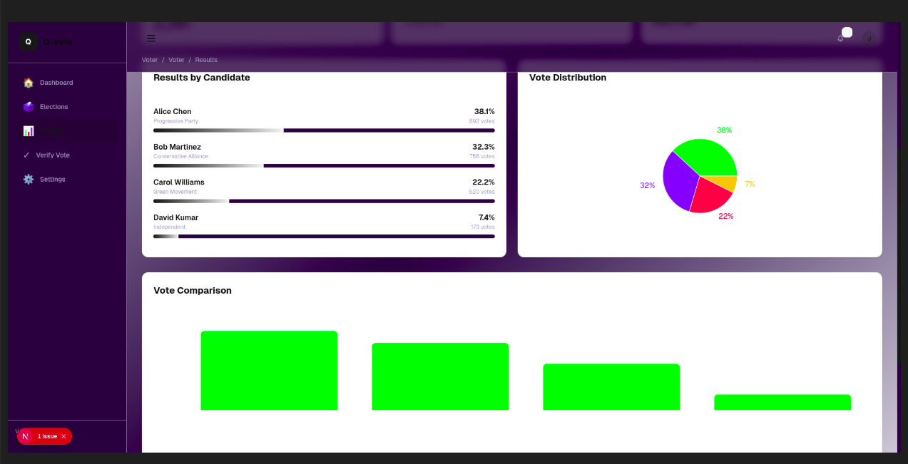

10. Voter Dashboard (Logged-in)
   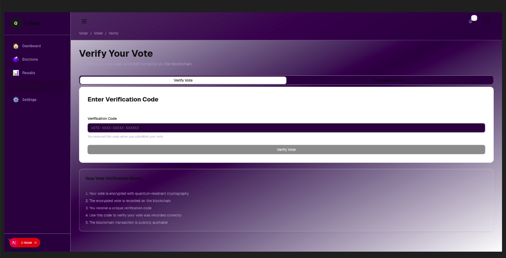

11. Results Visualizations
   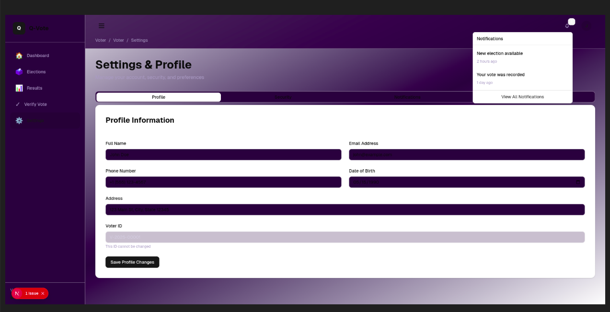

5. Quantum simulations

   cd quantum
   pip install -r requirements.txt
   python qkd_simulation.py

Replace commands above with actual scripts in your repo.

## Files & Docs

 - `/contracts` — smart contracts and tests
 - `/frontend` — React app (PWA)
 - `/backend` — API services (Node/Flask)
 - `/quantum` — Qiskit circuits and simulators
 - `/docs` — architecture & integration guides

## Roadmap & Pilot Plan

 - Phase 1 (2025): Pilot in university/county by-elections
 - Phase 2 (2026): Scale to selected counties
 - Phase 3 (Early 2027): National rollout preparation
 - Phase 4 (Aug 2027): Full deployment for general elections

## How to include your screenshots

1. Save the images to this directory with the filenames used above (screenshot1.png … screenshot7.png).
2. Commit and push:

   git add screenshot1.png screenshot2.png ... README.md
   git commit -m "Add README and demo screenshots"
   git push origin main

## Notes for judges / reviewers

 - This project demonstrates integration of Qiskit-based QKD simulations with Web3 primitives to produce an end-to-end blockchain voting prototype. The focus is on security, transparency, and practical Kenyan election requirements.

## License & Acknowledgments

Built for Qiskit Fall Fest 2025 — Strathmore University Edition.

Acknowledgements: IBM Quantum, Qiskit community, Strathmore University, IEBC advisors.

---

If you'd like, I can also add a short CONTRIBUTING.md, a minimal `requirements.txt` for the quantum folder, or create placeholder screenshot files (blank PNGs) so the README renders immediately. Tell me which you'd prefer and I'll add them.

---

**Q-Vote: Securing Kenya's Democracy for the Quantum Age** 🗳️⚛️🔐

*"Transparent. Verifiable. Quantum-Secured. The Future of Kenyan Elections."*
2. Commit and push:

   git add screenshot1.png screenshot2.png ... README.md
   git commit -m "Add README and demo screenshots"
   git push origin main

## Notes for judges / reviewers

- This project demonstrates integration of Qiskit-based QKD simulations with Web3 primitives to produce an end-to-end blockchain voting prototype. The focus is on security, transparency, and practical Kenyan election requirements.

## License & Acknowledgments

Built for Qiskit Fall Fest 2025 — Strathmore University Edition.

Acknowledgements: IBM Quantum, Qiskit community, Strathmore University, IEBC advisors.

---

If you'd like, I can also add a short CONTRIBUTING.md, a minimal `requirements.txt` for the quantum folder, or create placeholder screenshot files (blank PNGs) so the README renders immediately. Tell me which you'd prefer and I'll add them.

---

**Q-Vote: Securing Kenya's Democracy for the Quantum Age** 🗳️⚛️🔐

*"Transparent. Verifiable. Quantum-Secured. The Future of Kenyan Elections."*